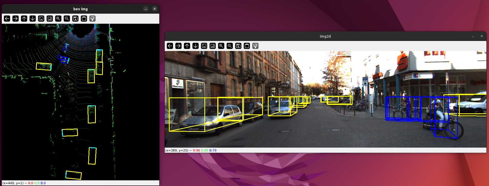
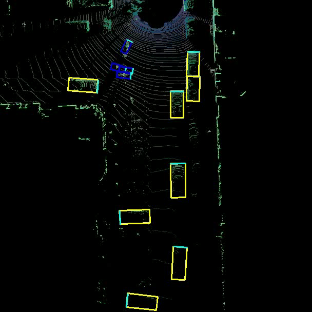

# readme

The objectiv here is to test the complex yolo and of course test it on some kitti data i will chose

## setup env
```bash
# create a python3.8 env using any adaquate method
# activte the env
uv pip install -r requirements.txt
uv pip install mayavi pyQt5 shapely
uv pip install torch==2.2.0 torchvision torchstudio
```

## load data

```bash
# download calibration data and labels
source data/run_download_and_unzip.sh
# put all data at the right place in the folder structure
# there ae some dependecies (velodyne files ans the images that were on a usb)
source data/kitti_data_prep.sh
# testout some predictions
python test_detection.py --split=sample --folder=sampledata  
# not tested
python test_both_side_detection.py --split=sample --folder=sampledata
# testout some predictions on my kitti files
python test_detection.py --split=sample2 --folder=2011_09_26_drive_0106_sync
```

## a code review

reading is code, the design pattern is very good. The implementation use, in a efficient ways old works. Still, there are some evident flaws in the code writing. For example, he created some files for kitti dataset but he could have avoided hard coding some variables into it.
He have a cool dataloader for his dataset.
He also has some utils function to help him in projections between (2D camera plane, 3D camera reference coordinates, 3D lidar reference coordinate)
Anyway, i know he use pretrained weights (yolov3 pretrained on some lidar bev map + labels).
Th ebev maps are generated by using as rgb, respectively, the density map, the height map and the intensity map (check the [function makeBVFeature of the file kitti_bev_utils](../utils/kitti_bev_utils.py) for the implementation)
To compute those maps, he get the unique (x,y,z) tuples from the point cloud. The density is the nb of repetitions of each point. He rescale using log and then normalize with log(64). The intensity map are the intensities of the actual unique points, same for the height map.
At inference, he feed the bev map to the model, get the predictions, run the latter through the projections to get boxes on a camera plane. In output, he use cv2 to show the image (+ boxes) and also show th ebev map with boxes



I could also save the images, then make it a video

## usage

The implementation use some module including the [yolov3 implmentation](https://github.com/eriklindernoren/PyTorch-YOLOv3) that GPL licensed so his code is also GPL licenses
But it is fait, i will use his code as a part of a whole used on top of other codes so i will not need to get my codebase GPL licensed but just his part

## make it a video

i have two feeds, bev and 2dcam
The input are the 40 first frames on a kitti sample


`bev video`


`cam video`

## related links

- [another repo testing yolov3](https://github.com/eriklindernoren/PyTorch-YOLOv3)
